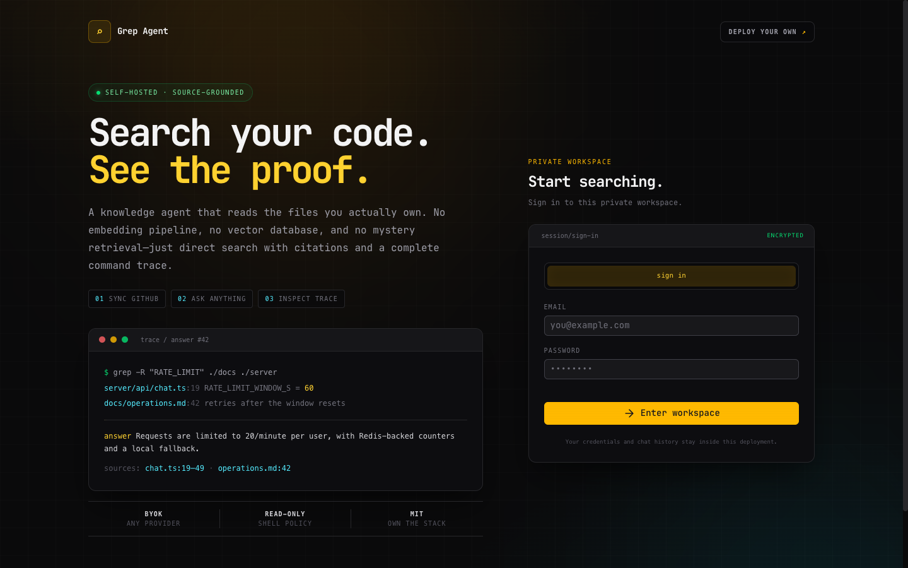

# Grep Knowledge Agent — self-hosted AI code search

**Search your code. See the proof.**

A self-hosted AI knowledge agent for GitHub repositories and technical documentation. It searches with `grep`, `find`, and `cat`, streams source-grounded answers, shows every command, and cites the exact files it used—without a vector database or embedding pipeline.

[](https://railway.com/deploy/grep-knowledge-agent?utm_medium=integration&utm_source=github&utm_campaign=grep-knowledge-agent)
[](LICENSE)
[](https://nuxt.com)
[](https://ai-sdk.dev)
[](https://github.com/jesseoue/grep-knowledge-agent/actions/workflows/ci.yml)



## Why use a grep-based knowledge agent?

- **Inspectable retrieval** — watch every read-only shell command and open the exact source files used.
- **No vector infrastructure** — no embeddings, chunking jobs, or vector database to provision.
- **Bring your own model** — use OpenRouter, OpenAI, Anthropic, or Google Gemini.
- **A real self-hosted stack** — the app, sandbox, PostgreSQL, Redis, and persistent snapshot volume deploy together.
- **Fast first run** — create an account, load the demo source, and ask a question.

### Grep agent vs. vector RAG

| | Grep Knowledge Agent | Typical vector RAG |
|---|---|---|
| Retrieval | Direct filesystem search | Embedding similarity search |
| Indexing pipeline | None | Chunk, embed, and re-index |
| Evidence | Commands, paths, and file references | Retrieved chunks |
| Infrastructure | Sandbox + persistent volume | Embedding model + vector database |
| Best for | Code, docs, runbooks, exact terms | Large semantic document collections |

## One-click deploy

[](https://railway.com/deploy/grep-knowledge-agent?utm_medium=integration&utm_source=github&utm_campaign=grep-knowledge-agent)

Railway provisions four services and wires their private URLs, generated secrets, databases, and persistent storage automatically:

| Service | Purpose |
|---|---|
| Web | Nuxt chat UI, auth, API, model routing, and source sync |
| Sandbox | Policy-restricted filesystem search and repository sync |
| PostgreSQL | Users, sessions, chats, sources, and usage records |
| Redis | Rate limits and lightweight coordination |

After deployment:

1. Add one AI key to the Web service. `OPENROUTER_API_KEY` is the simplest option; `OPENAI_API_KEY`, `ANTHROPIC_API_KEY`, and `GOOGLE_GENERATIVE_AI_API_KEY` also work. This is the only required manual variable.
2. Open the generated domain and create an email/password account.
3. Choose **Load demo source**, or add a public GitHub repository such as `nuxt/nuxt`.
4. Sync, then ask a question. The trace panel shows how the answer was found.

GitHub OAuth is optional. Add `GITHUB_CLIENT_ID` and `GITHUB_CLIENT_SECRET` only if you want a **Continue with GitHub** button.

## Good fits

- Product and API documentation Q&A
- Codebase orientation and architecture questions
- Support playbooks stored in Git
- Multi-repository internal knowledge search
- A transparent alternative to embedding-based RAG

## How it works

```text
Question
   │
   ▼
Nuxt web app ── complexity router ── chosen AI model
   │                                      │
   │ read-only commands                   │ streamed answer
   ▼                                      ▼
Sandbox sidecar ── grep/find/cat ── snapshot volume
   │
   └── command results + file references ──► trace panel
```

Repository sync uses a separate, validated sandbox endpoint. Chat-time tool calls stay on the read-only endpoint. Paths are confined to the configured snapshot root, shell constructs with write or execution risk are rejected, and command output is capped before it reaches the model.

## Configuration

| Variable | Required | Purpose |
|---|---:|---|
| `DATABASE_URL` | Yes | PostgreSQL connection string |
| `REDIS_URL` | Yes | Redis connection string |
| `SANDBOX_URL` | Yes | Private URL of the sandbox service |
| `BETTER_AUTH_SECRET` | Yes | Persistent session-signing secret; generated by the Railway template |
| One provider API key | Yes | OpenRouter, OpenAI, Anthropic, or Google Gemini |
| `SNAPSHOT_DIR` | No | Shared snapshot path; defaults to `/snapshot` |
| `PUBLIC_SITE_URL` | No | Custom public origin for authentication |
| `ALLOW_PUBLIC_SIGNUP` | No | Defaults to `false`; set `true` only for a deliberately shared workspace |
| `MAX_TOKENS_PER_USER` | No | Optional all-time per-user token quota; `0` is unlimited |
| GitHub OAuth credentials | No | Enables GitHub sign-in |

See [Environment variables](docs/ENVIRONMENT.md) for every option and provider setup.

## Local development

The easiest local setup uses Docker for PostgreSQL, Redis, and the sandbox:

```bash
docker compose up -d
bun install
cp apps/web/.env.example apps/web/.env
# Add one AI provider key to apps/web/.env
bun run db:push
bun run dev
```

Then open <http://localhost:3000>.

Run the same release gate as CI:

```bash
bun run verify
```

## Repository map

| Path | Contains |
|---|---|
| `apps/web` | Nuxt UI, Better Auth, API routes, database schema, and sync flow |
| `packages/agent` | Prompts, model tiers, and complexity routing |
| `packages/sdk` | Typed client, AI tools, and read-only shell policy |
| `sandbox-service` | Isolated command service and final policy enforcement |

## Security notes

- The AI-facing endpoint only accepts allowlisted read operations.
- The web and sandbox services independently validate agent commands.
- Sync writes use a distinct endpoint and are restricted to the snapshot directory.
- A shared `SANDBOX_SECRET` can authenticate private web-to-sandbox requests.
- The sandbox rejects browser-originated requests.
- Registration closes after the first workspace owner unless `ALLOW_PUBLIC_SIGNUP=true` is set explicitly.

This is defense in depth, not a substitute for reviewing the template and configuring Railway private networking before using sensitive repositories. Public repository sync is supported out of the box; private repository access is not built in.

## Documentation

- [Architecture](docs/ARCHITECTURE.md)
- [Deployment](docs/DEPLOYMENT.md)
- [Environment variables](docs/ENVIRONMENT.md)
- [Customization](docs/CUSTOMIZATION.md)
- [FAQ](docs/FAQ.md)
- [Contributing](CONTRIBUTING.md)
- [Security policy](SECURITY.md)
- [Changelog](CHANGELOG.md)

## License

MIT. Forked from [vercel-labs/knowledge-agent-template](https://github.com/vercel-labs/knowledge-agent-template); the upstream notice is preserved in [LICENSE](LICENSE).
